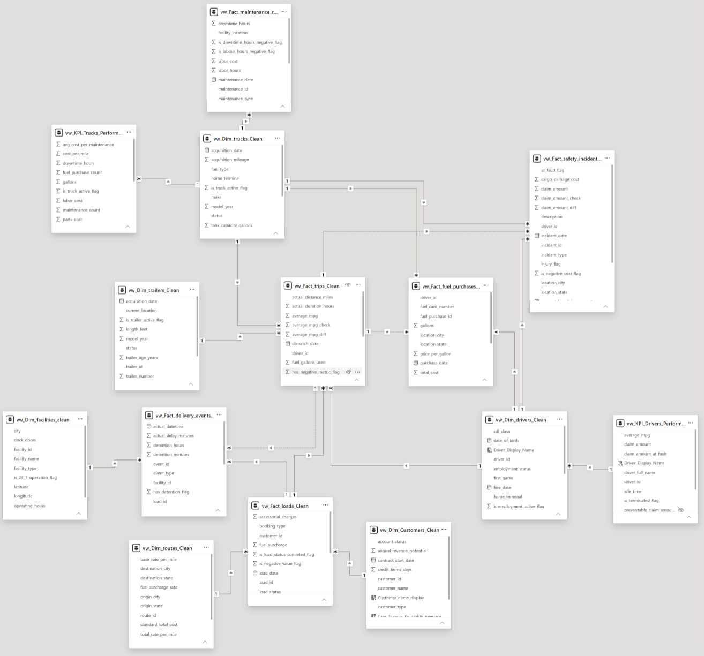
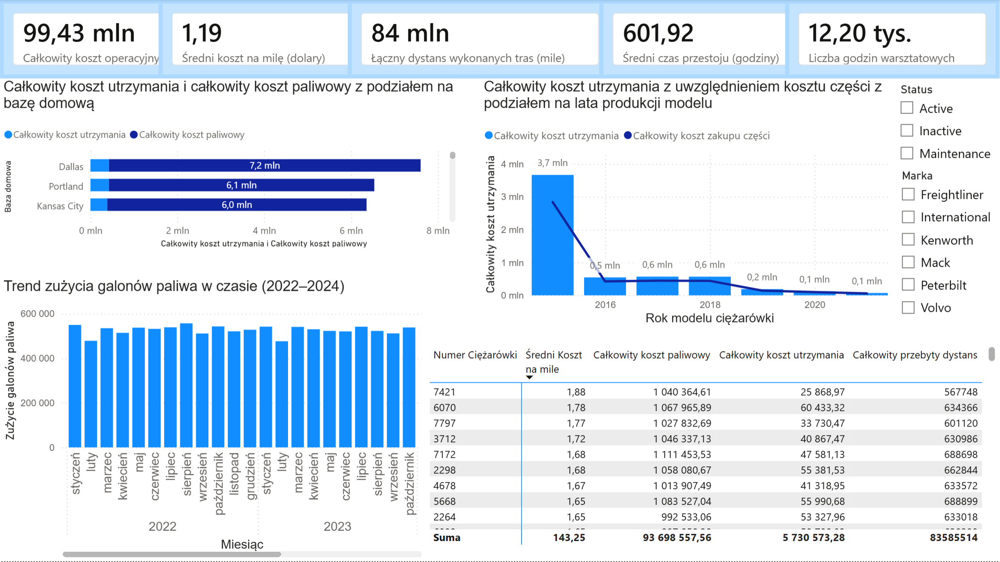
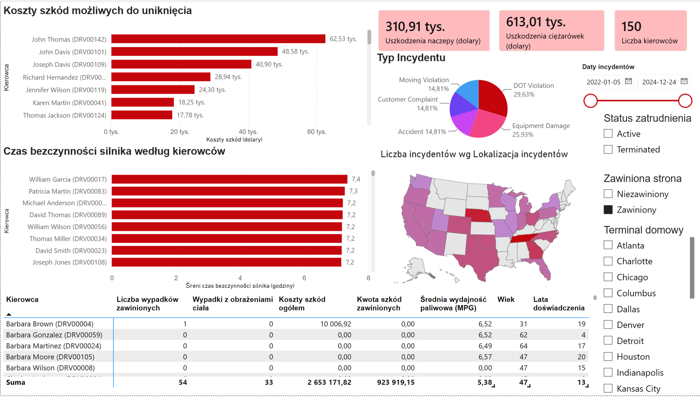
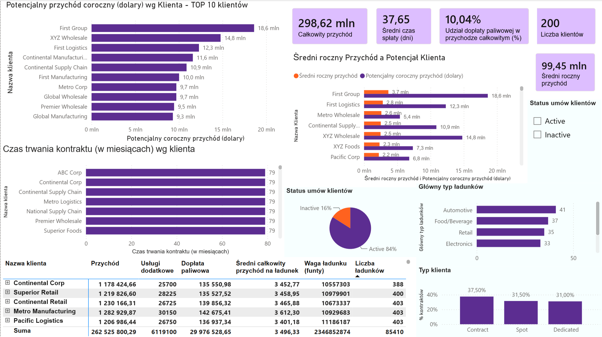
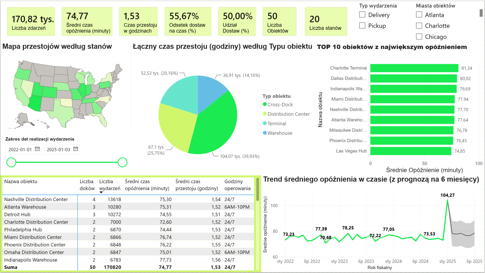

Markdown
#  Od surowych danych z Kaggle do kompletnego systemu BI w SQL i Power BI!

##  O projekcie
Kompleksowy system analityczny klasy **Business Intelligence** zaprojektowany dla branży logistyczno-transportowej. Projekt przedstawia pełny cykl życia danych: od surowych plików z Kaggle, przez proces inżynierii danych w **SQL**, aż po interaktywny dashboard w **Power BI**.

---

##  Architektura Danych i Proces ETL (SQL)
* **Model Danych:** Zintegrowany model wielofaktowy (**Multi-Fact Star Schema**) składający się z **6 tabel wymiarów** oraz **6 tabel faktów**.
* **Data Cleansing:** Oczyszczona baza danych z poprawnie zdefiniowanymi kluczami głównymi i obcymi. Wdrożono obsługę brakujących danych (rekordy typu `UNKNOWN` dla pustych ID w kluczach obcych).
* **Wydajność:** Utworzono dedykowane widoki SQL (`vw_...`) optymalizujące zapytania dla warstwy analitycznej.

---

##  Prezentacja Raportu w Power BI

### 1. Model Danych w Power BI
Poniższy schemat przedstawia relacje między tabelami wymiarów i faktów w Power BI:

### 2. Logistyka i Obiekty
Przegląd zdarzeń logistycznych, mapy przestojów oraz prognoza opóźnień na kolejne 6 miesięcy:

### 3. Efektywność i Koszty Operacyjne Floty
Analiza kosztów utrzymania, paliwa, korelacji wieku ciężarówek z kosztami części oraz baz domowych:

### 4. Bezpieczeństwo i Kierowcy
Zarządzanie ryzykiem, koszty szkód możliwych do uniknięcia oraz czas bezczynności silnika:

### 5. Klienci, Kontrakty i Przychody
Podsumowanie finansowe rzędu ~300 mln USD, TOP klientów oraz struktura umów i ładunków:

---

##  Wykorzystane Technologie
* **SQL Server / T-SQL** – ETL, widoki, czyszczenie danych, model gwiazdy.
* **Power BI & DAX** – Wizualizacja danych, miary dynamiczne, zaawansowane formatowanie.
